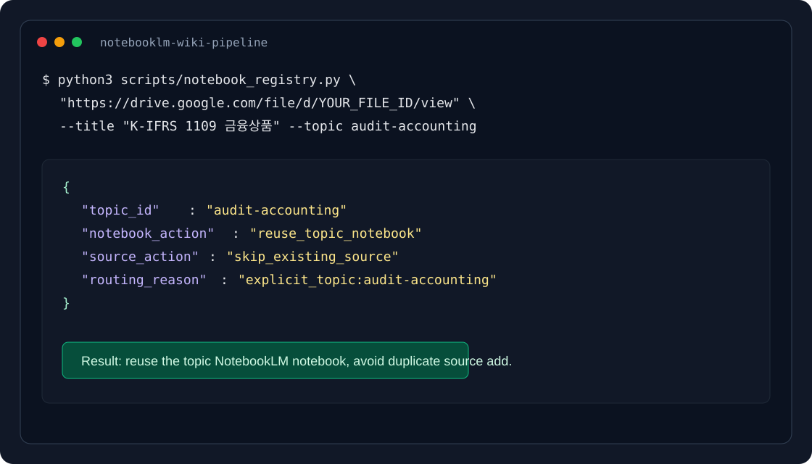

# NotebookLM Wiki Pipeline

[English README](README.md)

Drive에 있는 대용량 PDF를 Claude Code 컨텍스트에 직접 넣지 않고, NotebookLM이 먼저 읽게 한 뒤 결과만 받아 Obsidian Wiki 노트로 정리하는 토큰 절감 파이프라인입니다.

**vNext 핵심 업데이트:** PDF마다 새 NotebookLM 노트북을 만들지 않고, 감사/회계, 스테이블코인, 공공 인프라, 한국시장처럼 **주제별 Notebook**을 재사용할 수 있습니다. 동시에 신규 노트 생성 query는 방금 추가했거나 target으로 지정한 PDF source 하나로 제한합니다.

이 조합이 중요합니다. 주제별 Notebook은 장기적으로 재사용되는 지식 컨테이너이고, `source_ids`가 지정된 MCP query는 신규 Wiki 노트 생성 시 target PDF만 읽는 추출 단계입니다.

설치 후 Claude Code에서 한 줄로 실행합니다.

```
/pdf-to-wiki https://drive.google.com/file/d/YOUR_FILE_ID K-IFRS 1109 금융상품 --topic audit-accounting
```

> 기본 출력 경로는 예시입니다. 설치 후 `commands/pdf-to-wiki.md`의 `OUTPUT_DIR`을 본인 Obsidian vault 경로로 바꿔서 사용하세요.


위 스크린샷은 실제 NotebookLM 노트북 화면입니다. 저작권 리스크를 피하기 위해 직접 만든 공개 데모 PDF 3개를 사용했습니다. 하나의 공공 인프라 주제 Notebook 안에 clean energy, water resilience, public transit PDF가 함께 들어 있고, 신규 노트 생성 시에는 MCP의 `source_ids=[target_source_id]`로 clean energy target PDF만 질의했습니다.


---

## vNext: Topic Reuse + Source-Scoped Query

기존 방식은 안전하지만 NotebookLM 노트북이 PDF마다 늘어나는 문제가 있었습니다.

```text
PDF 1개 = NotebookLM 노트북 1개
```

vNext 방식은 다릅니다.

```text
주제 1개 = 재사용 가능한 NotebookLM 노트북 1개
신규 노트 생성 = 그 노트북 안의 target source 1개만 query
```

예를 들어 공공 인프라 주제 Notebook에 아래 PDF가 함께 들어 있을 수 있습니다.

- `clean_energy_grid_report.pdf`
- `water_resilience_brief.pdf`
- `public_transit_operations_note.pdf`

이 상태에서 `clean_energy_grid_report.pdf`만 Wiki 노트로 만들고 싶다면, NotebookLM MCP query에 target source만 넘깁니다.

```python
notebook_query(
    notebook_id="public-infrastructure-topic-notebook",
    source_ids=["target:clean-energy-grid-report"],
    query="Clean Energy Grid Planning Report만 기준으로 핵심 인사이트를 정리해줘"
)
```

실제 MCP 테스트에서 같은 Notebook 안에 clean energy, water resilience, public transit PDF가 함께 있었지만, `source_ids`를 clean energy PDF 하나로 지정하자 응답의 `sources_used`도 해당 source 하나만 반환되었습니다. 즉, **Notebook은 주제별로 재사용하면서도 질문은 첨부/선택된 PDF 하나에 한정할 수 있습니다.**

이 방식의 사용자 효익:

- 주제별 Notebook이 누적 지식 베이스가 되어 이후 비교 질문에 강해집니다.
- 같은 PDF를 매번 새 Notebook에 넣지 않아도 됩니다.
- 신규 Wiki 노트 생성 시에는 target PDF만 근거로 삼아 출처 혼입을 줄입니다.
- 완료 보고에 `target_source_id`, `sources_used`, `query_scope`를 남겨 검증 가능합니다.

핵심 제약:

- `notebook_query` 호출에서 `source_ids`를 반드시 지정해야 합니다.
- 일반 topic-level 질문은 모든 source를 볼 수 있으므로 Wiki 노트 생성용 query와 분리해야 합니다.
- source 추가 직후에는 title/author/topic 검증을 먼저 수행해 잘못된 PDF를 target으로 잡지 않도록 해야 합니다.

## 왜 필요한가

AI 코딩 도구의 성능이 좋아질수록 병목은 모델 지능보다 컨텍스트 관리와 토큰 비용이 됩니다. 특히 PDF, 보고서, 기준서, 매뉴얼처럼 긴 문서를 다룰 때는 원문 전체를 넣는 방식이 빠르게 한계에 부딪힙니다.

예를 들어 100페이지 PDF를 Drive MCP로 직접 읽으면 수만 토큰이 Claude 컨텍스트를 지나갑니다. 반면 이 파이프라인에서는 Claude Code가 PDF 본문을 직접 읽지 않습니다. Drive URL만 NotebookLM에 넘기고, NotebookLM이 내부에서 문서를 처리합니다. Claude Code는 NotebookLM의 분석 결과, 보통 수백~수천 토큰만 받아서 노트를 만듭니다.

| 방식 | Claude 컨텍스트에 들어오는 것 | 비용 |
|------|-------------------------------|------|
| PDF 직접 로드 | PDF 전체 텍스트 | 긴 문서일수록 토큰 급증 |
| NotebookLM 경유 | Drive URL + 분석 결과 텍스트 | 원문 독해 비용을 NotebookLM으로 이동 |

## 대상 사용자

- 긴 PDF를 AI에게 자주 읽히지만 토큰 비용과 컨텍스트 오염이 부담스러운 사람
- Google Drive, NotebookLM, Obsidian을 이미 업무 흐름에 쓰는 사람
- "대충 요약"이 아니라 나중에 다시 찾을 수 있는 개인 Wiki 노트를 만들고 싶은 사람
- Claude Code 같은 에이전트형 도구를 문서 처리 파이프라인의 조립자로 쓰고 싶은 사람

## 아키텍처

```text
Google Drive PDF
  |
  | Drive URL 또는 file ID만 전달. PDF 본문은 Claude 컨텍스트 비통과.
  v
Topic registry
  |
  | --topic 또는 routing_keywords 기준으로 NotebookLM 노트북 결정
  v
NotebookLM topic notebook 또는 single-source notebook
  |
  | notebook_query(source_ids=[target_source_id], 분석 프롬프트)
  v
분석 결과 텍스트 (500~2,000 토큰)
  |
  | Claude Code — Markdown 구조화 + [[wikilink]] 보강
  v
{your-obsidian-vault}/AI_Generated/{title}.md
```



---

## 전제 조건

| 항목 | 설명 |
|------|------|
| Claude Code | claude.ai 계정 필요. Pro 이상 권장 (MCP 통합 지원) |
| Google Drive 연결 | claude.ai → Settings → Integrations → Google Drive에서 OAuth 연결. **API 키 불필요.** |
| NotebookLM 계정 | Google 계정으로 로그인. Free tier 사용 가능 (쿼리 ~50회/일 제한) |
| Obsidian Vault | 로컬 Vault 디렉토리 경로 확인 필요 |
| `uv` | Python 툴 설치 관리자. `brew install uv` 또는 [공식 설치](https://docs.astral.sh/uv/getting-started/installation/) |

## 설치

**1. Google Drive를 claude.ai에 연결**

별도 API 키 없이 OAuth로 연결합니다.

```
claude.ai → Settings → Integrations → Google Drive → Connect
```

연결 후 Claude Code 세션에서 Google Drive MCP 도구가 자동으로 활성화됩니다.

**2. `notebooklm-mcp-cli` 설치**

```bash
uv tool install notebooklm-mcp-cli
```

**3. NotebookLM 로그인**

```bash
nlm login
```

브라우저가 열리며 Google 계정으로 인증합니다. 쿠키 기반이며 2~4주마다 재인증이 필요합니다.

**4. Claude Code에 MCP 서버 등록**

```bash
nlm setup add claude-code
```

**5. `/pdf-to-wiki` 슬래시 커맨드 등록**

이 레포의 `commands/pdf-to-wiki.md`를 Claude Code 커맨드 디렉토리에 복사합니다.

```bash
cp commands/pdf-to-wiki.md ~/.claude/commands/pdf-to-wiki.md
```

Claude Code 세션을 재시작하면 `/pdf-to-wiki`가 슬래시 커맨드로 자동 노출됩니다.

**6. 출력 디렉토리 설정**

`~/.claude/commands/pdf-to-wiki.md` 상단의 `OUTPUT_DIR`을 본인 Obsidian vault 경로에 맞게 수정합니다.

```text
OUTPUT_DIR=~/your-obsidian-vault/AI_Generated
```

생성된 노트가 저장될 디렉토리를 만듭니다.

```bash
mkdir -p ~/your-obsidian-vault/AI_Generated
```

---

## 사용법

### 기본 실행

Claude Code 세션에서 Drive URL 또는 파일 ID를 넘깁니다.

```
/pdf-to-wiki https://drive.google.com/file/d/YOUR_FILE_ID
```

제목과 주제를 직접 지정하려면 두 번째 인자와 `--topic`을 추가합니다.

```
/pdf-to-wiki https://drive.google.com/file/d/YOUR_FILE_ID K-IFRS 1109 금융상품 --topic audit-accounting
```

### 주제별 Notebook registry

`config/notebooks.example.json`을 복사해 본인 환경의 NotebookLM 노트북 ID로 채웁니다.

```bash
cp config/notebooks.example.json config/notebooks.local.json
```

예시 구조:

```json
{
  "default_policy": "single_source_notebook",
  "default_extraction_mode": "source_scoped_topic_query",
  "topics": [
    {
      "id": "audit-accounting",
      "label": "Audit and Accounting",
      "notebook_id": "NOTEBOOKLM_NOTEBOOK_ID_FOR_AUDIT",
      "routing_keywords": ["감사", "회계", "K-IFRS"],
      "sources": []
    }
  ]
}
```

### 주제별 Notebook 재사용의 이점

- 같은 분야의 PDF를 모아두면 새 문서 분석 시 기존 기준서, 리포트, 메모와 연결되는 지점을 바로 찾을 수 있습니다.
- NotebookLM의 같은 채팅에서 topic corpus 전체를 참조할 수 있어, 단일 PDF 요약보다 비교·차이·연관 개념 추출이 쉬워집니다.
- 이미 추가한 Drive file ID는 registry의 `sources`로 추적하므로 중복 source 추가를 피할 수 있습니다.
- Obsidian 노트에는 `topic`, `notebook_id`, `drive_file_id`가 남아 이후 재질의와 출처 추적이 쉬워집니다.

주의할 점도 있습니다. 같은 NotebookLM 노트북에 신규 PDF를 묶으면, 일반 질문은 이전 PDF까지 섞어 답할 수 있습니다. 그래서 신규 Wiki 노트 생성용 MCP 호출은 반드시 `source_ids=[target_source_id]`를 전달하고, 프롬프트에서도 target PDF만 primary scope로 선언합니다.

기본 운영 모드는 `source_scoped_topic_query`입니다.

1. 주제별 NotebookLM 노트북을 선택한다.
2. 대상 PDF를 해당 topic notebook에 source로 추가한다.
3. 신규 Wiki 노트용 query에서는 방금 추가한 `source_id` 또는 target `drive_file_id`를 명시하고, MCP의 `source_ids` 인자로 target source를 전달한다.
4. NotebookLM 답변은 대상 PDF만 primary 근거로 삼고, 기존 topic source는 비교/연결 섹션에서만 사용한다.

MCP tool schema가 특정 source 지정 query를 지원하지 않거나 동작이 불명확한 환경에서는 fallback으로 `single_source_first`를 사용할 수 있습니다. 이 경우에만 대상 PDF 전용 임시 노트북에서 먼저 추출합니다.

라우팅만 먼저 확인할 수 있습니다.

```bash
python3 scripts/notebook_registry.py \
  "https://drive.google.com/file/d/YOUR_FILE_ID/view" \
  --title "K-IFRS 1109 금융상품" \
  --topic audit-accounting \
  --registry config/notebooks.local.json
```

출력 예시:

```json
{
  "topic_id": "audit-accounting",
  "notebook_action": "reuse_topic_notebook",
  "extraction_mode": "source_scoped_topic_query",
  "extraction_notebook_action": "reuse_topic_notebook",
  "topic_notebook_action": "query_target_source_in_topic",
  "source_action": "add_source",
  "routing_reason": "explicit_topic:audit-accounting"
}
```

대상 PDF 한정 프롬프트만 출력하려면 `--print-prompt`를 붙입니다.

```bash
python3 scripts/notebook_registry.py \
  "https://drive.google.com/file/d/YOUR_FILE_ID/view" \
  --title "K-IFRS 1109 금융상품" \
  --topic audit-accounting \
  --registry config/notebooks.local.json \
  --print-prompt
```

### 실행 순서 (자동)

`/pdf-to-wiki`를 실행하면 Claude Code가 다음 단계를 자동으로 처리합니다.

1. Drive 파일 메타데이터 확인 (파일명, URL)
2. topic registry로 NotebookLM 노트북 재사용 여부 결정
3. 필요한 경우 topic NotebookLM 노트북에 대상 PDF를 source로 추가
4. topic NotebookLM 노트북에서 target source를 지정해 구조화 분석 쿼리 전송
5. 분석 결과를 Obsidian 노트로 변환 + `[[wikilink]]` 보강
6. `OUTPUT_DIR` 디렉토리에 저장
7. 완료 보고 (저장 경로, topic notebook ID, target source ID, topic, source 처리, 절감 토큰 추정)

### NotebookLM MCP 호출 형태

`notebooklm-mcp-cli`의 최신 MCP 도구는 통합 `source_add`를 사용합니다. Drive PDF는 URL 문자열보다 Drive 문서 ID를 우선 사용합니다.

```text
source_add(
  notebook_id="{notebook_id}",
  source_type="drive",
  document_id="{drive_file_id}",
  doc_type="pdf",
  wait=True,
  wait_timeout=120.0
)
```

설치 버전에 따라 `source_add` 파라미터가 조금 다를 수 있습니다. 동작이 맞지 않으면 `nlm doctor`, `nlm setup list`, `uv tool upgrade notebooklm-mcp-cli`로 설치 상태를 먼저 확인하세요.

### NotebookLM query scope

topic Notebook을 재사용하되 기본 분석은 target source에 한정합니다.

```text
notebook_query(source_ids=[target_source_id])
primary_scope: 대상 PDF만
source_scoped_query: NotebookLM query에서 target source_id만 대상으로 지정
topic_notebook_context: 같은 NotebookLM 노트북의 다른 PDF는 비교/연결 섹션에서만 참고
```

이 제한이 필요한 이유는 NotebookLM이 같은 노트북 안의 모든 source를 답변 근거로 사용할 수 있기 때문입니다. 기존 PDF까지 섞은 답변은 topic-level 인사이트에는 유용하지만, 신규 PDF 노트 생성에는 출처 오염이 생길 수 있습니다.

운영 모드:

| 모드 | 사용 시점 | 오염 리스크 |
|------|-----------|-------------|
| `source_scoped_topic_query` | 기본값. topic notebook 안에서 target source를 지정할 때 | 낮음 |
| `single_source_first` | source 지정 query가 불명확할 때의 fallback | 낮음 |
| 일반 topic query | topic-level 비교/질문 전용 | 높음 |

### 출력 노트 형식

```markdown
---
source: notebooklm
drive_url: {drive_url}
drive_file_id: {drive_file_id}
notebook_id: {notebook_id}
notebook_policy: {reuse_topic_notebook | create_single_source_notebook}
extraction_mode: {single_source_first | source_scoped_topic_query}
query_scope: target_source_only
topic: {topic_id | null}
created: {YYYY-MM-DD}
tags: [ai-generated, pdf-analysis]
---

# {wiki_title}

> AI 분석 요약 (원본: Google Drive PDF)
> 생성: {YYYY-MM-DD} | 도구: NotebookLM → Claude Code

{NotebookLM 분석 결과}

---
*이 노트는 /pdf-to-wiki 커맨드로 자동 생성됨. 원본 PDF: [{파일명}]({drive_url})*
```

---

## 인증 관리

NotebookLM 쿠키는 2~4주마다 만료됩니다. 인증 오류 발생 시:

```bash
nlm login
```

Free tier에서는 쿼리가 ~50회/일로 제한됩니다. 대량 처리 중 실패 시 인증 문제인지 일일 한도 초과인지 먼저 구분하세요.

---

## 사용 사례

**기준서·규정 정리** — K-IFRS, 감사기준, 법령처럼 길고 반복적으로 참조되는 PDF를 Wiki 노트로 변환합니다.

**리서치 PDF 요약** — 논문, 리포트, 산업 분석 자료를 핵심 개념과 시사점 중심으로 정리합니다.

**지식 베이스 구축** — 프로젝트마다 흩어진 PDF를 Obsidian의 연결형 Wiki로 축적합니다.

**코딩 세션 맥락 재사용** — 한 번 정리한 노트를 이후 Claude Code 세션의 짧은 컨텍스트로 재사용합니다. 매번 PDF 전체를 다시 넣지 않아도 됩니다.

---

## 주의사항

**하지 말아야 할 것:**

- Drive MCP로 PDF 본문 전체 다운로드 (`download_file_content` 사용 금지)
- 로컬에서 PDF 텍스트 추출 후 프롬프트에 붙여넣기
- 서로 무관한 여러 PDF를 하나의 topic NotebookLM 노트북에 혼합

**올바른 방식:**

- Drive MCP는 파일명·URL 확인에만 사용
- 주제가 명확한 문서 세트는 topic NotebookLM 노트북 재사용
- 주제가 불명확한 문서는 single-source NotebookLM 노트북 생성
- 같은 Drive file ID가 이미 topic registry에 있으면 source 추가 생략
- NotebookLM source에는 Drive URL 또는 파일 ID만 전달

---

## 실패 대응

| 오류 | 원인 | 해결 |
|------|------|------|
| 인증 오류 | NotebookLM 쿠키 만료 | `nlm login` 재실행 후 세션 재시작 |
| source 처리 지연 | NotebookLM PDF 처리 시간 | 1분 대기 후 source 상태 재확인 |
| Drive 접근 오류 | PDF 공유 권한 없음 | Drive 파일 공유 설정 확인 |
| 쿼리 한도 초과 | Free tier ~50회/일 제한 | 다음 날 재시도 또는 처리량 축소 |
| 답변이 너무 일반적 | 프롬프트 맥락 부족 | "감사 실무자 관점에서", "K-IFRS 기준으로" 등 맥락 명시 |

---

## 프로젝트 구성

```text
.
├── config/
│   └── notebooks.example.json    ← topic NotebookLM registry 예시
├── commands/
│   └── pdf-to-wiki.md      ← /pdf-to-wiki 슬래시 커맨드 (설치 시 ~/.claude/commands/ 에 복사)
├── scripts/
│   └── notebook_registry.py      ← topic routing / duplicate source helper
├── tests/
│   └── test_notebook_registry.py ← deterministic registry tests
├── docs/
│   ├── assets/                   ← README diagrams / screenshots
│   └── adr/
│       └── 0001-notebooklm-mcp-approach.md
├── examples/
│   ├── input.md            ← 실행 입력 예시
│   └── output-note.md      ← 생성 노트 예시
```

## 테스트

라우팅과 중복 source 판정은 로컬에서 deterministic test로 확인합니다.

```bash
python3 -m unittest tests/test_notebook_registry.py -v
```

## 설계 결정

NotebookLM MCP 방식을 채택한 이유는 `docs/adr/0001-notebooklm-mcp-approach.md`에 정리되어 있습니다.

- Gemini API는 공식적이고 안정적이지만 별도 API 키와 구현이 필요합니다.
- NotebookLM MCP는 비공식 내부 API 기반이라 깨질 수 있지만, 설정이 간단하고 NotebookLM의 문서 처리 경험을 그대로 활용할 수 있습니다.
- 이 파이프라인은 운영 시스템이라기보다 개인 지식 관리 도구이므로, 현재는 실용성이 우선입니다.

## 로드맵

- [ ] 여러 PDF 일괄 처리 플로우 ([#3](https://github.com/capitalparser/notebooklm-wiki-pipeline/issues/3))
- [ ] 생성 노트의 wikilink 후보 자동 점검 ([#1](https://github.com/capitalparser/notebooklm-wiki-pipeline/issues/1))
- [ ] NotebookLM 노트북 재사용 정책 ([#2](https://github.com/capitalparser/notebooklm-wiki-pipeline/issues/2))
- [x] 샘플 입력/출력 노트 추가 (`examples/`)

로드맵 항목은 GitHub Issues로 관리합니다.

## 라이선스

MIT License. 자세한 내용은 [LICENSE](LICENSE)를 참고하세요.
