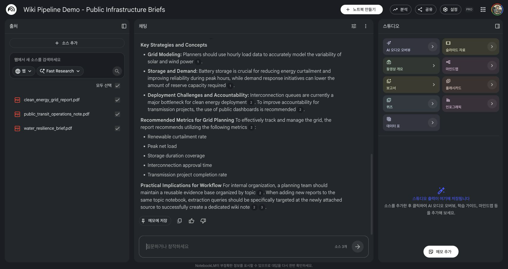
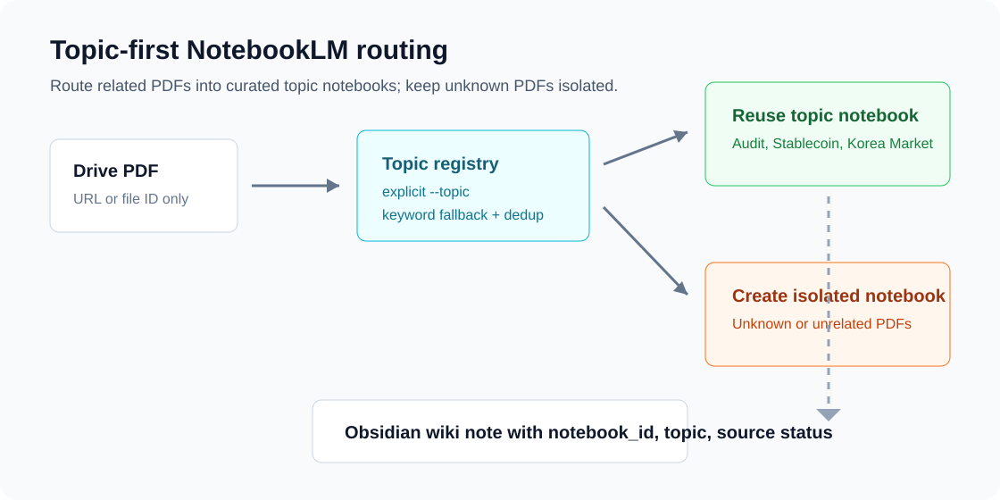

# NotebookLM Wiki Pipeline

[한국어 README](README.ko.md)

Turn large Google Drive PDFs into Obsidian wiki notes without loading the full PDF text into Claude or Codex context. NotebookLM reads the source, and the agent receives only the structured answer needed to create a reusable note.

**vNext update:** reuse one NotebookLM notebook per topic, while each new note-generation query is scoped to the newly attached or selected PDF source.

That is the main product value:

```text
Topic notebook = reusable knowledge container
MCP query with source_ids = target-PDF-only extraction
```

```bash
/pdf-to-wiki https://drive.google.com/file/d/YOUR_FILE_ID "K-IFRS 1109 Financial Instruments" --topic audit-accounting
```



The screenshot above is an actual NotebookLM notebook screen from a live MCP test using original public-safe demo PDFs. The topic notebook contains three related infrastructure sources: clean energy grid planning, urban water resilience, and public transit operations. For note generation, the MCP call used `source_ids=[target_source_id]`, and NotebookLM returned `sources_used` with only the target clean-energy source.

---

## Why This Matters

The old safe pattern was:

```text
1 PDF = 1 NotebookLM notebook
```

That avoids source contamination, but it does not scale well. Users who process many PDFs about the same topic end up with scattered one-off notebooks.

The vNext pattern is:

```text
1 topic = 1 reusable NotebookLM notebook
1 new wiki note = query only 1 target source inside that notebook
```

For example, a `public-infrastructure` notebook can contain:

- `clean_energy_grid_report.pdf`
- `water_resilience_brief.pdf`
- `public_transit_operations_note.pdf`

When you want a wiki note for only the clean-energy grid PDF, call:

```python
notebook_query(
    notebook_id="public-infrastructure-topic-notebook",
    source_ids=["target:clean-energy-grid-report"],
    query="Summarize insights using only the Clean Energy Grid Planning Report."
)
```

The notebook remains reusable for future topic-level questions, but the note extraction remains grounded in one selected PDF.

## User Benefits

- Reuse topic notebooks instead of creating one notebook per PDF.
- Keep related PDFs together for later cross-document questions.
- Generate a new wiki note from only the newly attached or selected source.
- Reduce answer contamination by passing `source_ids=[target_source_id]`.
- Record `target_source_id`, `sources_used`, and `query_scope` in the completion report.

## Architecture

```text
Google Drive PDF
  |
  | pass Drive URL or file ID only
  v
Topic registry
  |
  | choose topic notebook by --topic or routing keywords
  v
Reusable NotebookLM topic notebook
  |
  | notebook_query(source_ids=[target_source_id], query=...)
  v
NotebookLM answer grounded in the target PDF
  |
  | agent formats Markdown and wikilinks
  v
Obsidian wiki note
```



## Installation

1. Connect Google Drive in Claude.

```text
claude.ai -> Settings -> Integrations -> Google Drive -> Connect
```

2. Install `notebooklm-mcp-cli`.

```bash
uv tool install notebooklm-mcp-cli
```

3. Log in to NotebookLM.

```bash
nlm login
```

4. Register the MCP server with Claude Code.

```bash
nlm setup add claude-code
```

5. Install the slash command.

```bash
cp commands/pdf-to-wiki.md ~/.claude/commands/pdf-to-wiki.md
```

6. Configure the output directory in `~/.claude/commands/pdf-to-wiki.md`.

```text
OUTPUT_DIR=~/your-obsidian-vault/AI_Generated
```

## Topic Registry

Copy the example registry and fill in your own NotebookLM notebook IDs.

```bash
cp config/notebooks.example.json config/notebooks.local.json
```

Example:

```json
{
  "default_policy": "single_source_notebook",
  "default_extraction_mode": "source_scoped_topic_query",
  "topics": [
    {
      "id": "public-infrastructure",
      "label": "Public Infrastructure",
      "notebook_id": "NOTEBOOKLM_NOTEBOOK_ID_FOR_PUBLIC_INFRASTRUCTURE",
      "routing_keywords": ["clean energy", "water resilience", "public transit", "infrastructure"],
      "sources": []
    }
  ]
}
```

Check the routing decision locally:

```bash
python3 scripts/notebook_registry.py \
  "https://drive.google.com/file/d/YOUR_FILE_ID/view" \
  --title "Clean Energy Grid Planning Report" \
  --topic public-infrastructure \
  --registry config/notebooks.local.json
```

Expected decision shape:

```json
{
  "topic_id": "public-infrastructure",
  "notebook_action": "reuse_topic_notebook",
  "extraction_mode": "source_scoped_topic_query",
  "extraction_notebook_action": "reuse_topic_notebook",
  "topic_notebook_action": "query_target_source_in_topic",
  "source_action": "add_source"
}
```

## MCP Calls

Add the PDF to the topic notebook:

```text
source_add(
  notebook_id="{topic_notebook_id}",
  source_type="drive",
  document_id="{drive_file_id}",
  doc_type="pdf",
  wait=True,
  wait_timeout=120.0
)
```

Then query only the target source:

```text
notebook_query(
  notebook_id="{topic_notebook_id}",
  source_ids=["{target_source_id}"],
  query="{target-PDF-only prompt}"
)
```

The prompt should also state the scope:

```text
primary_scope: target PDF only
source_scoped_query: query only this target source_id
topic_notebook_context: other PDFs in the same notebook may be used only for a separated comparison section
```

## Source Verification Gate

The live test found an important operational gap: Drive search may return a wrong PDF when filenames are generic. Before generating the final note, run a short source verification query:

```text
Using only target_source_id, verify the document title, author, and topic.
If it is not the requested document, stop and report source_mismatch.
```

This prevents the pipeline from summarizing a wrong source that happened to match the search query.

## Output Note Metadata

Generated notes should preserve the routing and query scope:

```yaml
source: notebooklm
drive_url: {drive_url}
drive_file_id: {drive_file_id}
notebook_id: {topic_notebook_id}
target_source_id: {target_source_id}
sources_used: [{target_source_id}]
notebook_policy: reuse_topic_notebook
extraction_mode: source_scoped_topic_query
query_scope: target_source_only
topic: {topic_id}
created: {YYYY-MM-DD}
tags: [ai-generated, pdf-analysis]
```

## Testing

Run deterministic routing tests:

```bash
python3 -m unittest discover -v
```

Run a CLI smoke test:

```bash
python3 scripts/notebook_registry.py \
  "https://drive.google.com/file/d/YOUR_FILE_ID/view" \
  --title "Clean Energy Grid Planning Report" \
  --topic public-infrastructure
```

## Guardrails

- Do not download full Drive PDF content into the agent context.
- Do not paste extracted PDF text into prompts.
- Use Drive only for metadata and source IDs.
- Use NotebookLM `source_add` for PDF ingestion.
- Use `notebook_query(source_ids=[target_source_id])` for new note extraction.
- Keep topic-level comparison questions separate from target-source note generation.

## Project Structure

```text
.
├── config/
│   └── notebooks.example.json
├── commands/
│   └── pdf-to-wiki.md
├── scripts/
│   └── notebook_registry.py
├── tests/
│   └── test_notebook_registry.py
├── docs/
│   ├── assets/
│   └── adr/
└── examples/
```
